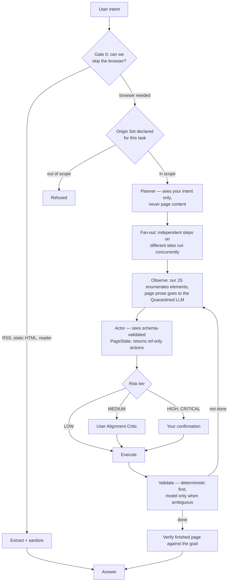

# Echo

A desktop AI assistant that reads your screen, drives a real browser, and remembers what you tell it — built so that **untrusted content can never steer it**.

Echo is not a chat wrapper. It is an agentic system where every action passes through a layered guardrail stack before it runs: a quarantined model handles all external content, an independent critic reviews proposed actions against your original intent, and a deterministic policy layer decides what needs your sign-off. The interesting part of this repo is that security architecture, not the tool list.

Built with Google's `google-genai` SDK against Gemini. Runs on Windows.

> **Status: personal project, actively developed.** The core agent, memory, voice pipeline, screen context and browser automation all work and are tested. OS-level control, personalization and a proper UI are on the [roadmap](#roadmap). Expect rough edges — this is a portfolio and learning project, not a product.

---

## What it can do

Eight tools are registered with the model today:

| Tool | What it does | Risk tier |
|---|---|---|
| `web_search` | Tavily search — snippets and sources, for general knowledge and finding *which* site to read | LOW |
| `read_web_page` | Fetch and extract one page with **no browser**: RSS → Trafilatura → Jina Reader | LOW |
| `browse_task` | Full multi-step browser automation in real Chrome — search boxes, forms, date pickers, multi-site comparison | MEDIUM |
| `get_screen_context` | Text description of your focused window via the Windows Accessibility API — no screenshot, no pixels | LOW |
| `see_screen` | Screenshot of the focused window, analysed by a vision model, then discarded | MEDIUM |
| `get_weather` | OpenWeather current conditions | LOW |
| `get_upcoming_events` | Google Calendar, read-only | LOW |
| `remember_fact` | Persist a fact about you to long-term memory | LOW |

Around those:

- **Memory that persists across sessions.** ChromaDB vectors fused with BM25 keyword search via Reciprocal Rank Fusion. Writes are ADD-only — a changed fact is stored alongside the old one and recency surfaces the current one at read time, so nothing is silently overwritten. Relevant memories are auto-injected into every turn, explicitly labelled as possibly-stale background that the current message outranks.
- **Voice, running alongside typing.** Wake word or push-to-talk → Silero VAD → faster-whisper → the same agent turn → sentence-streamed TTS. Voice and text share one agent and one interaction chain, so you can speak a fact and then type a question about it. Barge-in cuts speech mid-sentence.
- **Three-tier screen context.** No ambient capture, ever. Tier 1 is a structured element tree (<50ms, no pixels). Tier 2 is a screenshot, only when you explicitly ask, discarded after analysis. Nothing is written to disk outside an active task.

---

## How it's built

### The execution pipeline

Every browser task runs through this. Each gate is code, not a model being asked nicely.



### The security model

**Dual-LLM.** The model that owns tools never reads text written by someone else. All external content — page prose, feeds, files, clipboard — goes to a *quarantined* model with no tools, no history, and no way to emit free text. Its output is forced through a Pydantic schema. That is the actual mechanism: an injected instruction cannot survive being compressed into `summary: str` and `key_facts: list[str]`, because there is no field for it to come out of.

**The Actor's entire vocabulary is a ref we issued.** Element references are numbers our own JavaScript stamps onto the DOM. The Actor cannot write a CSS selector and cannot type a URL — navigation takes an opaque `[url:N]` handle that resolves against the page's own redaction registry. "Go to https://attacker.test" in page text has nowhere to land, before Origin Sets even get a say.

**Agent Origin Sets.** Each task declares its domains up front. Anything outside is refused by a set-membership test in Python, decided before any model sees the destination. Redirect *destinations* are checked too, or an open redirect on an allowed host would be a free way out. When steps fan out across sites, each branch is scoped to **only its own site** — stricter than the task-wide set it would inherit running sequentially.

**User Alignment Critic.** An isolated model instance that sees only your original request and one proposed action — never the conversation, never page content. It can APPROVE, ESCALATE (ask the user) or VETO. A veto blocks the action but not the task, and does not spend the step's budget: a safety layer that starves the step it supervises is a safety layer that causes failures.

**Confirmation fatigue is treated as a security failure.** The deterministic CRITICAL list is deliberately narrow — place order, pay now, delete account, credential fields — because a user prompted about "Submit feedback" ten times learns to hit `y` without reading, and the eleventh prompt gets the same reflex. Everything else state-changing goes to the Critic, which has your actual request in front of it.

**Some actions are refused, not confirmed.** The agent has no legitimate source for a password, so anything it types into one is invented. Asking you to approve *"fill Password with 'password123'"* only launders a bad action, so credential fills are refused deterministically.

**Honesty overrides.** A success claim that cites no evidence from the page is overridden in code. Field order in the outcome schema is load-bearing — the model must describe the page and name what is missing *before* it commits to a verdict, because a verdict generated first gets everything after it written to agree.

Verified against a page carrying four simultaneous attacks (visible agent-directed text, CSS-hidden text, zero-width obfuscation, an exfiltration image): the attacker domain never reaches the content channel, and the agent completes the real goal without clicking "Delete account" or "Place order" despite repeated instructions to.

### Cost control

A live browser is the most expensive and most dangerous way to read a page, so most requests never launch one — Gate 0's RSS → Trafilatura → Jina ladder answers anything that is really just reading. Beyond that: an action cache replays known workflows with zero model calls, a plan cache skips re-planning, digests are skipped on rounds where the page hasn't materially changed, and validation is deterministic before it is ever a model call.

Profiling put ~82% of a browser step in sequential model calls and ~7% in actual browser work — so `browse_task` accepts a `lookups` list that fans several per-site lookups out concurrently, one tab each, in a single call.

---

## Getting started

### Prerequisites

- **Windows 10/11.** Screen context uses the Windows Accessibility API; the browser stack is tested here only.
- **Python 3.13** (3.11+ should work).
- **Google Chrome** installed.
- A **Gemini API key with billing enabled.** The free tier will not work — it returns 429s on Pro models and multi-minute silent hangs that look identical to a freeze. Check the Plan column at [aistudio.google.com/apikey](https://aistudio.google.com/apikey).

### Install

```bash
git clone <your-repo-url>
cd AI_Project/assistant

python -m venv .venv
.venv\Scripts\activate          # Windows
pip install -r requirements.txt

# Chrome binary for the stealth-patched Playwright fork
python -m patchright install chrome
```

### Configure

```bash
copy .env.example .env
```

Then fill in `assistant/.env`:

| Key | Needed for | Required? |
|---|---|---|
| `GOOGLE_API_KEY` | Everything | **Yes** |
| `TAVILY_API_KEY` | `web_search` | Optional |
| `OPENWEATHER_API_KEY` | `get_weather` | Optional |
| `google_credentials.json` | `get_upcoming_events` | Optional |
| `ELEVENLABS_API_KEY` | Cloud TTS instead of local | Optional |
| `SAFE_BROWSING_API_KEY` | URL reputation checks | Optional |

Every tool degrades to a clear message when its key is missing rather than crashing — you can start with just `GOOGLE_API_KEY`.

**Google Calendar** needs two steps beyond creating OAuth credentials: enable the Calendar API on your Cloud project, and add your own Google account as a **test user** on the OAuth consent screen (the app stays in "Testing" status). Put the downloaded file at `assistant/google_credentials.json`.

### Voice models (optional)

Voice input works out of the box — the Silero VAD graph is committed, and faster-whisper downloads its model on first run. Voice *output* needs Kokoro, which is ~354MB and therefore not in the repo:

Download `kokoro-v1.0.onnx` and `voices-v1.0.bin` from [kokoro-onnx releases](https://github.com/thewh1teagle/kokoro-onnx/releases/tag/model-files-v1.0) into `assistant/models/kokoro/`.

Without them, Echo still listens and transcribes — it just prints replies instead of speaking them.

---

## Running it

All commands run from the `assistant/` directory.

```bash
python main.py                # text mode
python main.py --voice        # voice + text together
python main.py --voice -v     # with pipeline logging
```

In voice mode the typed REPL keeps working — say something, then type a follow-up about it. Press `Ctrl+Space` (or say "Hey Jarvis" with `VOICE_ACTIVATION=wakeword`) to speak. Type `exit` to quit.

> The wake phrase is "Hey Jarvis", not "Hey Echo". openWakeWord ships six pretrained models and none of them is Echo; training a custom one is a separate project.

Things worth trying:

```
what's on my screen?
remember that I prefer aisle seats
what's the price of <product> on <retailer>?
compare the price of <item> across <site A>, <site B> and <site C>
```

The last one is where the architecture shows: it fans out across three sites concurrently, each branch scoped to only its own domain.

---

## Project structure

```
assistant/
├── main.py                     # CLI entry point — the only file that owns print/input
├── agent.py                    # One turn, UI-agnostic
├── config.py                   # All settings, resolved against BASE_DIR not cwd
│
├── llm/
│   ├── gemini_client.py        # Privileged LLM: tool loop, streaming, memory injection
│   ├── ollama_client.py        # Local model client, for the private-mode Critic
│   ├── retry.py                # Transient-failure retry, classified by SDK exception type
│   └── metrics.py              # Per-role call timing
│
├── guardrails/                 # ← the security stack
│   ├── prompt_injection_detector.py  # The Quarantined LLM. Schema-forces all external content
│   ├── user_alignment_critic.py      # APPROVE / ESCALATE / VETO, isolated context
│   ├── origin_sets.py                # Task-scoped domain access, enforced deterministically
│   ├── risk_classifier.py            # LOW/MEDIUM/HIGH/CRITICAL — narrow by design
│   ├── confirmation.py               # Registered callback, never a bare input()
│   └── audit_log.py                  # critic_decisions.jsonl + events.jsonl
│
├── browser/
│   ├── no_browser_gate.py      # Gate 0: RSS → Trafilatura → Jina → NEEDS_BROWSER
│   ├── engine.py               # Patchright on one dedicated thread + tab registry
│   ├── page_actions.py         # Element enumeration (all frames + shadow roots), click/fill/nav
│   ├── page_state.py           # Schemas: elements are ours, digest is the Quarantined LLM's
│   ├── task_runner.py          # Planner/Actor/Validator loop, fan-out, re-planning
│   ├── content_extractor.py    # Image stripping, URL redaction, invisible chars, Safe Browsing
│   ├── action_cache.py         # DOM→action cache keyed on LABEL, not selector
│   ├── plan_cache.py           # task→steps
│   ├── checkpoint.py           # Resumable task state, including the page it was on
│   └── ledger.py               # Session facts carried between tasks, locators stripped
│
├── voice/
│   ├── session.py              # Voice + text concurrently, one Agent
│   ├── audio_io.py             # One shared 16kHz mic stream, fanned to subscribers
│   ├── vad.py, stt.py, tts.py  # Silero / faster-whisper / Kokoro+ElevenLabs
│   ├── echo_guard.py           # Rejects the assistant's own audio from the mic
│   ├── sentence_buffer.py      # Token deltas → whole sentences, for streaming TTS
│   └── wake_word.py, hotkey.py, cues.py, text_normalizer.py
│
├── vision/
│   ├── accessibility_reader.py # Tier 1: element tree, no pixels
│   ├── context_analyzer.py     # Tier 2: screenshot → vision model, isolated client
│   ├── screen_capture.py       # Returns PNG bytes, never writes to disk
│   └── overlay.py              # Security toasts (Qt runs in a subprocess — see the docstring)
│
├── memory/
│   ├── store.py                # MemoryRouter — the only class the agent imports
│   ├── text_memory.py          # ChromaDB + sentence-transformers
│   └── coherence.py            # ADD-only tagging, recency decay, rerank
│
├── tools/                      # Thin adapters: every tool returns a plain string
├── prompts/system_prompt.txt   # Includes the security thought-reinforcement directive
└── tests/browser/              # See below
```

---

## Testing

Run from `assistant/`. **Start with the offline suites** — they take seconds, need no network, and cover the loop's control flow and security invariants:

```bash
python -m tests.browser.test_invariants        # 51 checks: fan-out, ledger, re-planning, scope
python -m tests.browser.test_loop_properties   # 300 generated pages; asserts rules, not incidents
python -m tests.browser.hostile_page           # the four-attack page, 12 assertions
```

The archetype corpus exercises real behaviour against local fixtures and **costs API calls**:

```bash
python -m tests.browser.run_corpus --runs 3
python -m tests.browser.run_corpus --only autocomplete,calendar -v
python -m tests.browser.run_corpus --exclude multi-vendor --runs 1   # much faster pass
python -m tests.browser.real_sites --runs 1                          # read-only, real network
```

Three things about this suite are deliberate and worth knowing before you read its output:

- **It reports pass *rates*, not pass/fail.** Most of what decides a browser task is model judgement, which is not deterministic. The same test can pass, fail, then pass with no code change. A suite reporting "3 failed" from a single run produces confident conclusions from insufficient evidence.
- **Four outcomes, and only one fails the build.** `PASS`, `HONEST_FAIL` (didn't do it and said so — the user is correctly informed), **`WRONG`** (confidently asserted something false — *this* is the failure that costs something), and `ERROR` (infrastructure; excluded from rates, because a rate over runs that never happened measures nothing).
- **Archetypes are patterns, not sites.** A hard flight-search page is not a target to support; it is *autocomplete + calendar + multi-field form*, and those are what get modelled.

---

## Configuration

Every knob lives in `assistant/.env` and is documented inline in [`.env.example`](assistant/.env.example). A few that matter more than they look:

| Setting | Why it matters |
|---|---|
| `BROWSER_HEADLESS=false` | Headless **defeats** the stealth patches. Measured 31/31 detection tests headed vs 28/31 headless. |
| `BROWSER_WINDOW_SIZE=1920,1080` | Not cosmetic. Chrome's ~800×600 default makes responsive sites serve compact layouts and hide controls the agent needs. |
| `BROWSER_USER_DATA_DIR` | Defaults to a dedicated **logged-out** profile, so an injected page that hijacks the agent has no sessions to abuse. |
| `BROWSER_MAX_ITERATIONS_PER_STEP` | A runaway guard, not the usual limit — stalls end a step. A ceiling, not a quota. |
| `CONFIRM_HIGH_RISK=true` | Typed confirmation for irreversible actions. Leave it on. |
| `JINA_READER_ENABLED` | Sends the URL to a third party. Set false to keep every fetch first-party. |

---

## Roadmap

**Next up:** OS control — file operations, process management and shell execution, with Origin Sets extended from domains to filesystem paths.

**After that:** personalization and preference learning · a custom "Hey Echo" wake word · a proactive engine that acts on calendar and filesystem triggers · multimodal memory · a fully local/private mode with no network calls · user-selectable models per role rather than being pinned to one provider.

**Interface.** The terminal REPL is scaffolding, never the intended front end. The plan is a **web app** people can just open and use, rather than something they have to install. The core is already built for that: `print()` and `input()` are confined to `main.py`, and `Agent.respond(on_delta=...)` already streams tokens to any consumer, so a real interface is an additive layer rather than a refactor. Screen context and OS control need code on the user's machine, so those stay part of a local companion build.

---

## License

Not yet licensed. Add one before reuse.
